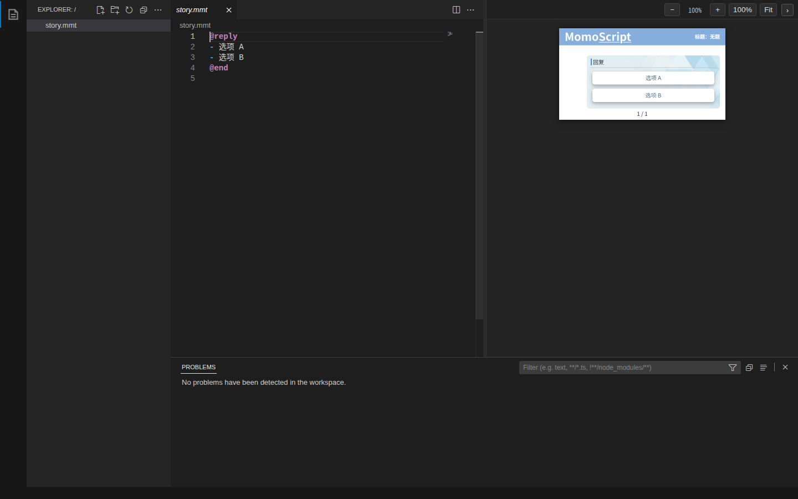
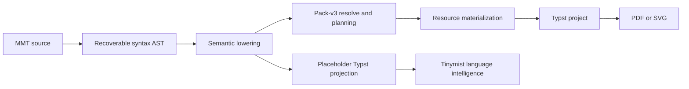

# MomoScript

[](https://app.netlify.com/projects/momoscript/deploys)

MomoScript（MMT）是一套面向 Momotalk / MoeTalk 风格视觉叙事的领域特定语言与工具链。项目以 Rust DSL v2 为当前主线，将文本脚本解析为可恢复语法树和语义模型，解析人物与资源包引用，生成 Typst 工程，并在桌面、浏览器和 NoneBot 场景中提供编辑与渲染能力。

> 项目仍在快速开发中。Rust v2 的行为测试与活动 OpenSpec 是当前语法真源；Python v1 仅用于兼容历史工作流。



## 核心能力

- **Rust DSL v2**：可恢复解析、UTF-8 source ranges、语义 lowering、资源解析与 Typst façade emission。
- **Pack v3 资源系统**：实体、slot、set、variant、ordinal selector，以及 image-dir / AVIFS image-sequence 存储。
- **原生与 WASM LSP**：诊断、补全、悬停、签名帮助、文档符号、折叠和 MMT → Typst 投影。
- **VS Code Desktop / Web 扩展**：MMT TextMate grammar、嵌入式 Typst 高亮和 Tinymist 语言能力。
- **浏览器编辑器**：VS Code Web API、持久化工作区、Typst SVG 预览、资源拉取与物化。
- **NoneBot 集成**：通过 Rust v2 project pipeline 生成可发送的渲染结果。

## 仓库结构

```text
.
├── mmt_rs/               # Rust DSL v2 parser、pipeline、pack resolver 与 emitter
├── mmt_lsp/              # Native/WASM 共用语言服务
├── editors/vscode/       # VS Code Desktop/Web 扩展、Worker 与 vendored artifacts
├── editors/vscode-web/   # 当前生产 Web 编辑器
├── typst_sandbox/        # Typst 模板与 pack-v3 资源
├── mmt_nonebot_plugin/   # NoneBot 适配器
├── mmt_core/             # Legacy Python DSL v1
├── tools/                # 构建、验证与历史流水线工具
├── openspec/             # 当前规格与活动变更设计
└── examples/             # 示例脚本与历史输出
```

旧 `web/` React 编辑器已停止扩展；浏览器端开发统一位于 `editors/vscode-web/`。

## 环境要求

- Rust 1.92+
- Node.js 22.12+
- Python 3.10+ 与 [uv](https://docs.astral.sh/uv/)（仅 Python/NoneBot 工作流）
- Typst 0.15（原生最终编译）
- 可选：`avifdec`，用于原生 AVIFS 帧物化

## 快速开始

### 启动 Web 编辑器

```bash
cd editors/vscode-web
npm install
npm run dev
```

生产构建：

```bash
npm run check
npm run build
```

### 验证 Rust v2 core 与语言服务

```bash
cargo test --manifest-path mmt_rs/Cargo.toml --all-targets
cargo test --manifest-path mmt_lsp/Cargo.toml
```

### 导出 Typst 工程

```bash
cargo run --manifest-path mmt_rs/Cargo.toml --bin mmt-compile -- \
  --input examples/example_t.mmt.txt \
  --output-dir /tmp/mmt-project \
  --manifest typst_sandbox/pack-v3/ba_kivo/manifest.json \
  --template-dir typst_sandbox/mmt_render

typst compile --root /tmp/mmt-project \
  /tmp/mmt-project/main.typ /tmp/mmt-project/output.pdf
```

CLI 会向 stdout 输出 JSON report，并在失败时返回非零状态。资源物化结果写入受控工程目录和内容寻址缓存，不直接信任脚本中的任意文件路径。

### 启动 NoneBot

```bash
uv sync
# 按 mmt_nonebot_plugin/README.md 准备 .env
uv run bot.py
```

## DSL 示例

```mmt
@document
title: 无题
author: xiyihan
show-header: true
compiled-at: auto
compiled-at-format: "[year]-[month]-[day] [hour]:[minute]:[second]"
timezone: local
@end

@actor 花子
preset: ba:hanako
@end

> 花子: T"""#strong[你好。] [:#1:]"""
- rT"""旁白保持 raw Typst body。"""
```

正文模式：

- `t`：普通文本并解析 MMT inline marker。
- `T`：Typst body，并叠加 MMT inline marker。
- `rt`：raw 普通文本。
- `rT`：raw Typst body。

`@document` 必须是文件内唯一、位于正文前的聚合块。`compiled-at` 可写固定文本或 `auto`；自动时间由 CLI/预览 host 注入，同一 Web 文档 revision 内保持不变，显式刷新后更新。`timezone` 接受 `local`、`utc`、`Z` 或 `±HH:MM`。CLI 的 `--title`、`--author`、`--show-header` / `--no-header`、`--compiled-at` 会逐字段覆盖脚本设置；`--clock RFC3339` 用于可复现导出。

Ordinal sticker selector 写作 `[:#1:]`。完整规则以以下材料为准：

1. `mmt_rs/` 行为测试；
2. `openspec/changes/redesign-dsl-syntax-v2/specs/dsl-syntax/spec.md`；
3. `openspec/changes/redesign-dsl-syntax-v2/specs/dsl-parser-architecture/spec.md`。

`openspec/specs/dsl-syntax/spec.md` 和 `typst_sandbox/mmt_render/mmt_help_syntax.typ` 主要记录 legacy Python v1，不能作为 Rust v2 selector 或 directive 的判定依据。

## 编译与编辑流程



原生构建使用平台 materializer 生成自包含 Typst 工程；编辑器语言路径使用 placeholder 投影获得 Tinymist 能力；Web 预览则按文档 revision 拉取并解码资源，通过 typst.ts 生成 SVG。

## 编辑器开发与验证

```bash
cd editors/vscode
npm install
npm run check
npm run test:grammar
npm run test:worker

# 需要本地 Tinymist binary
TINYMIST_BIN=/path/to/tinymist npm run test:tinymist-process

# 需要固定 Tinymist Web package
TINYMIST_WEB_PKG="$PWD/vendor/tinymist-0.15.2" npm run test:tinymist-worker
TINYMIST_WEB_PKG="$PWD/vendor/tinymist-0.15.2" npm run test:web
```

Web 端：

```bash
cd editors/vscode-web
npx playwright install chromium
npm run check
npm run test:e2e
npm run test:avifs-worker
```

`editors/vscode/vendor/` 中的语言服务产物必须通过项目脚本更新，避免手工复制导致 WASM 与 checksum 不一致：

```bash
cd editors/vscode
npm run vendor:mmt-lsp
```

## OpenSpec

影响 DSL 语义、渲染结果、资源解析、编辑器行为或公开工作流的变更，应先与 OpenSpec 对齐：

- 项目上下文：`openspec/project.md`
- 稳定能力：`openspec/specs/`
- 活动变更：`openspec/changes/`

当前重点包括 DSL v2、pack v3、MMT LSP / VS Code 集成和 Tinymist 投影边界。

## 部署

Netlify 配置位于仓库根目录 `netlify.toml`，构建目标为 `editors/vscode-web`：

```bash
npx netlify deploy --build
npx netlify deploy --build --prod
```

生产 Web 编辑器默认从 HTTPS pack-v3 manifest 获取资源，不依赖旧版 `VITE_MMT_*` 环境变量。

## 项目状态与边界

- Rust v2 是主实现；legacy Python v1 不再定义新语法。
- 当前 Web 编辑器已支持实时编辑、语言服务、资源预览和工作区恢复。
- 部分资源包受独立 EULA 约束，不随 MPL-2.0 自动获得再分发许可。
- DSL、pack schema 和编辑器集成仍可能在 OpenSpec 变更完成前调整。

## License

代码以 [MPL-2.0](LICENSE) 发布。第三方素材与资源包可能适用各自许可或 EULA。
