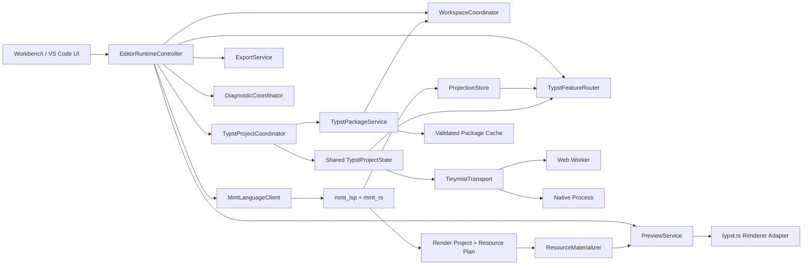

# Design: Coordinated editor runtime and complete Typst tooling

## 1. Design principles

1. **Authored source wins.** MMT or standalone Typst text in the workspace is the source of truth. Projection, materialization, render and preview are derived and disposable.
2. **One owner per mutable state.** Transport clients carry bytes; coordinators own lifecycle and ordering.
3. **A result without snapshot identity is unusable.** Every asynchronous result must prove which authored and derived inputs produced it.
4. **Read mapping and edit mapping are different trust levels.** A read result may navigate to a read-only virtual dependency. An edit must map completely and atomically to current authored documents.
5. **Capabilities are observed, not assumed.** The fixed native and Web Tinymist artifacts must publish captured `initialize` capability manifests. Optional providers are enabled only when the active artifact advertises them.
6. **MMT remains no-I/O.** `mmt_rs`, `mmt_lsp` projection analysis and Tinymist project evaluation receive only host-supplied bytes.
7. **Desktop/Web share policy.** Platform code implements primitives, not semantics.
8. **No silent downgrade.** Missing capability, stale result, unsafe edit, offline dependency and runtime recovery are distinct visible states.
9. **Bounded work.** Queues, retained revisions, package archives, virtual files, render artifacts and caches have explicit limits.
10. **Clean cutover.** After migration, duplicated project-state maps and feature-specific lifecycle paths are deleted.

## 2. Baseline and prerequisites

### 2.1 Existing contracts retained

The design retains these `add-mmt-lsp-vscode` requirements:

- negotiated MMT position encoding and valid UTF boundary checks;
- versioned document snapshots;
- no-I/O full Typst projection;
- continuous `ProjectionSegment` coverage;
- Identity-only reverse mapping for edits;
- revision-scoped projection entry URIs;
- stale revision and retired session rejection;
- Worker/process restart and latest-project replay;
- MMT-native result precedence;
- Desktop/Web use of the same Rust mapper.

### 2.2 Prerequisite closure

Tasks 10.1–10.7 of `add-mmt-lsp-vscode` must be complete before visible feature expansion. In particular:

- one parse/analysis/index must feed live diagnostics and projection;
- render/preview diagnostics must be revision-bound;
- production Web must have an initial single runtime owner and reliable dispose;
- `didChange` must be the only document version advancement path.

This change may introduce shared types needed by that closure, but it must not create a parallel diagnostic or document synchronization route.

### 2.3 Capability qualification gate

Before specifying a provider as required for implementation, build scripts SHALL capture normalized `initialize` results from:

- the pinned native Tinymist process artifact;
- the pinned browser Tinymist Worker artifact.

The checked capability baseline may identify exact canonical artifact bytes. A native
release build is not assumed to be bit-reproducible across checkout paths and host
linkers: CI pins the upstream revision、maintained patch digest and Rust toolchain,
computes a SHA-256 manifest for the produced process binary, verifies the binary
against that run-local manifest, and compares its normalized behavior with the
checked baseline while excluding only the native digest fields. That manifest travels
with the immutable native artifact to downstream jobs. The browser Worker remains
byte-pinned to its checked SHA-256 because its WASM build is reproducible under the
pinned toolchain.

The normalized manifest includes:

```text
BackendCapabilityManifest {
  protocol_version
  backend_name
  backend_version
  artifact_digest
  position_encoding
  providers {
    completion { trigger_characters, resolve }
    hover
    signature_help { trigger_characters, retrigger_characters }
    semantic_tokens { legend, full, range }
    definition
    type_definition
    implementation
    references
    rename { prepare }
    document_formatting
    document_range_formatting
    document_symbol
    workspace_symbol { resolve }
    document_highlight
    selection_range
    document_link { resolve }
    document_color
    color_presentation
    code_action { kinds, resolve }
    inlay_hint { resolve }
    code_lens { resolve }
  }
  experimental_methods[]
}
```

Dynamic registrations received after `initialized` are applied to a runtime capability registry and recorded in transcript fixtures. A feature is:

- **core-required** only if both fixed artifacts advertise a compatible provider and the shared transcript succeeds;
- **host-optional** if only one artifact advertises it or semantics differ;
- **unavailable** if neither advertises it.

A future task may upgrade or patch fixed artifacts to satisfy a desired provider. Until then the UI and specs cannot claim it.

## 3. Target architecture



### 3.1 `EditorRuntimeController`

The controller is the only component allowed to create or stop long-lived services. It owns:

- runtime lifecycle state;
- active clients and adapters;
- document subscriptions;
- project coordinator;
- preview and export services;
- package and resource services;
- diagnostic coordinator;
- quiesce and dispose barriers.

It does not parse MMT, render SVG itself or implement platform I/O.

### 3.2 `TypstProjectCoordinator`

The coordinator owns semantic project lifecycle for both standalone Typst and MMT projections:

- accepted source session and revision;
- current full project and deltas;
- canonical entry URI;
- files required by each project generation;
- open/applied/retained/closing file generations;
- project prime scheduling;
- latest request tokens;
- restart replay set;
- package/dependency injection;
- per-project capability readiness.

### 3.3 `TinymistTransport`

Transport implementations own only:

- process/Worker start and stop;
- JSON-RPC serialization;
- pending request IDs, cancellation and timeouts;
- raw request/notification dispatch;
- transport error reporting.

They do not own project revisions, retained files, prime queues or restart replay selection.

Interface:

```text
TinymistTransport {
  start(init: TinymistInitializeParams) -> BackendSession
  request(method, params, cancellation) -> response
  notify(method, params)
  on_notification(handler)
  on_server_request(handler)
  on_failure(handler)
  stop(deadline)
  terminate_now()
}
```

`BackendSession` returns the normalized capability manifest and session generation.

### 3.4 `TypstFeatureRouter`

The router:

1. identifies standalone Typst, MMT-native or embedded Typst routing;
2. checks active backend capability;
3. resolves the current `ProjectionKey` when needed;
4. converts positions into backend encoding;
5. issues the request with cancellation and request identity;
6. checks backend generation and projection currency on response;
7. maps ranges/edits through Rust;
8. converts results into client encoding;
9. returns a typed success, unavailable, stale or unsafe result.

### 3.5 Platform adapters

Shared code consumes:

```text
WorkspaceAdapter
NetworkAdapter
PackageCacheAdapter
RuntimeArtifactAdapter
PreviewRendererAdapter
Clock
DigestProvider
```

Desktop may implement these with VS Code filesystem, native process and disk cache. Web may use `mmtfs`, Fetch, Worker, IndexedDB/Cache Storage and typst.ts. Policy remains shared.

## 4. Runtime lifecycle

### 4.1 Global state machine

```text
Created
  -> StartingWorkspace
  -> StartingMmt
  -> StartingTypst
  -> Ready
  -> Quiescing
  -> Stopping
  -> Stopped

Any starting/ready state -> Failed
Failed -> Recovering -> Ready | FailedTerminal
```

Invariants:

- a state transition is serialized;
- every created child service is registered immediately for reverse-order rollback;
- `Ready` is published only after document synchronization and capability manifests are installed;
- new language/preview/export work is rejected after `Quiescing` begins;
- graceful stop has a deadline; Worker/process termination is synchronous fallback after the deadline;
- HMR and page unload call the same idempotent terminate path;
- recovery increments `backend_generation`; responses from older generations are rejected.

### 4.2 Per-source projection state

```text
Absent
  -> AwaitingFull(session)
  -> Ready(session, revision)
  -> Advancing(session, revision+1)
  -> Ready(session, revision+1)
  -> Retiring(session)
  -> Absent
```

Rules:

- a new session starts only with `full=true`;
- revision is strictly increasing within a session;
- an old session becomes permanently retired once a new full session is accepted;
- a delta from an unknown or retired session is rejected;
- the newest accepted project is the only target for new requests;
- at most two prior applied file generations are retained for in-flight responses;
- close occurs after the existing bounded grace and only if no active generation references the file;
- restart materializes the latest applied full plus every accepted delta into one complete representation of the newest revision, then replays only that representation.

### 4.3 Request identity

Every backend request carries host-side metadata:

```text
FeatureRequestKey {
  backend_generation
  method
  source_content_key?
  source_stale_token?
  typst_project_snapshot_key
  projection_key?
  request_sequence
}
```

A response is publishable only when:

- cancellation has not fired;
- backend generation still matches;
- source content still matches and the local stale token is current for source-bound requests;
- Typst project snapshot still identifies the same complete workspace/dependency graph;
- projection key is current for projected requests;
- package and dependency generations captured by the project key are unchanged;
- the target editor document version has not advanced for edit-producing responses.

`document_incarnation` is a host-generated nonce created for each open document instance. It is retired on close and never reused; equal URI、version and content after reopen do not make an old response publishable.

## 5. Snapshot identity

### 5.1 Keys

```text
LogicalSourceId {
  logical_workspace_id
  canonical_workspace_relative_path
}

SourceContentKey {
  logical_source_id
  utf8_digest
}

SourceStaleToken {
  host_uri
  document_incarnation
  document_version
}

TypstProjectSnapshotKey {
  logical_workspace_id
  canonical_file_content_digests
  package_generation_digests
  generated_dependency_digests
  project_options_digest
}

ProjectionKey {
  source: SourceContentKey
  session
  revision
  logical_entry_id
  project_digest
  mapping_digest
}

MaterializationKey {
  projection: ProjectionKey
  pack_registry_digest
  resource_plan_digest
  resource_bytes_digest
}

RuntimeArtifactKey {
  typst_compiler_version
  typst_wasm_digest
  renderer_version
  renderer_wasm_digest
  template_bundle_digest
  font_set_digest
}

RenderKey {
  materialization: MaterializationKey
  runtime: RuntimeArtifactKey
  render_options_digest
}
```

Digests use SHA-256 over canonical length-delimited records. JSON object insertion order, Map iteration order and filesystem traversal order must not affect a digest.

### 5.2 Canonical project digest

The project digest includes, in canonical `LogicalProjectFileId` order:

```text
LogicalProjectFileId =
  Workspace { logical_workspace_id, canonical_workspace_relative_path }
  | Package { namespace, name, version, package_generation_digest, canonical_package_relative_path }
  | Generated { dependency_origin, producer_digest, canonical_origin_relative_path }
```

The digest serializes:

- logical entry file ID;
- every logical project file ID;
- file kind and content digest;
- source map digest;
- dependency origin (`template`, `authored`, `package`, `materialized-resource`);
- package identity where applicable.

Presentation/backend URIs (`file:`, `mmtfs:`, internal Worker/process mount URIs), transient absolute cache paths、document-incarnation/version tokens、timestamps、request IDs and platform-specific separators are excluded. Host adapters map a logical ID to their local URI only after canonical identity is established. Shared fixtures MUST prove that equal logical files mounted under different Desktop/Web URI schemes serialize byte-for-byte identically.

### 5.3 Preview artifact

```text
PreviewArtifact {
  render_key
  source_uri
  pages[]
  sanitized_svg
  page_geometry
  location_map?
  warnings[]
}
```

The preview panel displays one immutable artifact at a time. A newer source revision marks it stale immediately but does not mutate its identity.

### 5.4 Export rule

`ExportService.export(render_key, format)` must use the exact virtual files, resources, fonts and runtime artifacts represented by the key.

- SVG/PNG/JPEG derive from the displayed sanitized SVG artifact.
- PDF may re-run the compiler only in an immutable renderer session reconstructed from the same `RenderKey` inputs.
- if reconstruction inputs were evicted, export fails with `ArtifactUnavailable`; it must not use current mutable shadows.
- if the displayed artifact is stale, the UI offers `export displayed revision` or `wait for latest`; it never silently substitutes.

## 6. Position encoding bridge

### 6.1 Encodings

Three coordinate domains are explicit:

1. `ClientPosition<MmtClientEncoding>`: encoding negotiated by MMT LSP (`utf-8` or `utf-16`).
2. `ByteRange`: Rust internal UTF-8 byte offsets.
3. `BackendPosition<TinymistEncoding>`: encoding accepted by the active Tinymist session, currently expected to be UTF-16 but read from qualification/session state.

TypeScript protocol structures SHALL wrap positions with their encoding domain at module boundaries. Plain `{line, character}` values are not passed across coordinator layers.

### 6.2 Request conversion

Projected request:

```text
client position
  -> current MMT LineIndex -> UTF-8 byte offset
  -> ProjectionStore map to projected UTF-8 byte offset
  -> projected LineIndex -> backend position encoding
```

Standalone Typst request:

```text
VS Code document position (UTF-16)
  -> explicit backend encoding conversion when backend != UTF-16
```

### 6.3 Response conversion

Backend ranges are decoded using the exact virtual file generation used for the request, not the latest text. Rust mapping returns authored byte ranges; the matching `SourceContentKey` selects the line index while the current `SourceStaleToken` guards client publication and edit application.

### 6.4 Failure

Conversion fails on:

- invalid line/character;
- split UTF-8 code point;
- split UTF-16 surrogate pair;
- absent exact file generation;
- stale projection;
- range crossing incompatible segments.

No conversion clamps or guesses.

## 7. Typst feature routing

### 7.1 Capability classes

#### Class A: current baseline

Diagnostics, completion, hover, signature help and semantic tokens already have explicit fixed-artifact coverage. They migrate to the generic router without semantic change.

#### Class B: desired core authoring features

Definition, references, prepare rename/rename, formatting/range formatting and Typst document symbols become core-required only after both fixed artifacts pass qualification. If qualification fails, the artifact update is a blocking task, not an implementation assumption.

#### Class C: optional negotiated features

Type definition, implementation, workspace symbols, document highlights, selection ranges, links, colors, code actions, inlay hints and code lenses are implemented only when advertised and after method-specific mapping rules exist.

### 7.2 Routing precedence

For an MMT document:

1. ask MMT service when the feature has native semantics;
2. if MMT returns a definitive result, return it;
3. otherwise ask `mmt/typstPosition` or a method-specific query anchor;
4. if no current safe route exists, return no result;
5. never merge Typst edits with an MMT-native edit unless one Rust transaction validates the combined workspace edit.

For standalone `.typ`, route directly to the active project and backend, but every request and response remains bound to its complete `TypstProjectSnapshotKey`.

### 7.3 Read result mapping

Read features include hover, definitions, type definitions, implementations, references, document highlights, selection ranges, links, colors, symbols, hints and lenses.

Each returned location is classified:

- `AuthoredMmt`: map to current MMT URI/range.
- `WorkspaceTypst`: return actual workspace URI/range.
- `PackageFile`: return immutable read-only package URI/range.
- `ProjectionIdentity`: map to MMT.
- `ProjectionGenerated`: return a read-only virtual projection URI only when the feature is navigation and the exact generation is retained.
- `UnknownOrStale`: omit the item and record debug telemetry; if every item is omitted, return an explicit stale/unsafe internal result.

A read result list may safely omit individual unmappable locations only if the method semantics permit partial results. Rename and formatting never permit partial mapping.

### 7.4 Payload-bearing provider safety

“Read” classification does not imply a response is side-effect free. `ColorPresentation` text edits、`InlayHint` text edits/label commands、`CodeLens` commands、document-link targets and any future provider payload pass through the same URI、snapshot、edit transaction and command allowlist used by explicit edit features. For projected routes, unsafe fields are stripped only when the protocol declares the remaining item semantically complete; otherwise the item is rejected. Unknown commands、host-I/O commands、stale payloads and edits outside current Identity segments are never published or executed.

### 7.5 Selection range mapping

Nested selection ranges are mapped from inner to outer. Mapping stops before the first parent that:

- crosses a segment boundary;
- enters generated content;
- refers to a stale generation.

The already mapped child chain remains valid.

### 7.6 Symbol merging

- MMT document symbols come only from `mmt_lsp` for `.mmt`.
- standalone Typst document symbols come only from Tinymist.
- workspace symbol query asks MMT and Typst indexes concurrently when available.
- results are normalized by canonical URI/range/kind/name and deduplicated.
- generated projection symbols are hidden unless they map to authored Identity ranges.
- package symbols may appear only when the package is part of an active project and use read-only package URIs.

## 8. Edit transaction

### 8.1 Why a transaction is required

A rename or code action can touch many files and ranges. Validating edits one by one and applying the survivors would corrupt semantics. The entire workspace edit is accepted or rejected.

### 8.2 Transaction input

```text
ProjectedEditTransaction {
  feature_request_key
  source_content_keys[]
  source_stale_tokens[]
  projection_keys[]
  backend_workspace_edit
}
```

### 8.3 Validation

The Rust mapper validates:

1. backend generation and every projection revision are current;
2. every edited URI resolves to an exact retained generation;
3. every text edit has a valid non-overlapping range in backend encoding;
4. every projection edit lies completely in one Identity segment;
5. mapping preserves text length assumptions required by Identity mode;
6. mapped edits target authored MMT or real writable workspace Typst files only;
7. edits do not target package files, templates, generated wrappers or materialized resources;
8. resulting edits are non-overlapping after mapping and URI normalization;
9. document versions still match transaction inputs;
10. resource operations (`create`, `rename`, `delete`) are rejected unless a method-specific contract explicitly allows them. The first implementation allows text edits only.

### 8.4 Application

- return a versioned edit batch only after full validation;
- apply multi-document batches through `WorkspaceCoordinator.atomicApply`, which captures target preimages, journals the intended batch, commits all targets and rolls back every committed target on failure;
- allow normal `didChange` events to create new snapshots only after commit succeeds;
- never call `mmt/updateDocument` as a second synchronization path;
- until `atomicApply` and rollback are implemented and proven, projected edit-producing providers are restricted to one writable document; a partial commit is a fatal invariant violation and MUST leave the coordinator-restored preimages as the visible workspace state.

### 8.5 Prepare rename

`prepareRename` succeeds only if:

- the backend advertises prepare support or a method-specific safe fallback exists;
- the cursor maps to one current Identity segment or a writable standalone Typst file;
- the returned placeholder range maps wholly to the same writable authored document.

Otherwise it returns no rename target with a user-readable reason where the client API supports one.

### 8.6 Formatting

- standalone Typst: full and range formatting are allowed when advertised.
- MMT document: full-document formatting is owned by an MMT formatter and is not delegated.
- embedded Typst: only range formatting wholly inside one Identity segment is eligible.
- every returned edit must remain inside that same segment after mapping; otherwise reject the entire result.
- format-on-save never formats embedded Typst through Tinymist until an explicit MMT format pipeline composes both languages atomically.

### 8.7 Code actions and commands

A code action is accepted only when:

- all edits pass the transaction;
- diagnostics referenced by the action belong to the same current snapshot;
- command-only actions are on a shared allowlist and cannot access host paths, network, clipboard or shell;
- a command requiring backend mutable project state is rejected after backend restart.

## 9. Typst package and dependency service

### 9.1 Trust boundary and backend protocol

Tinymist may request a logical package identity or file. It never supplies an arbitrary trusted download URL. The host derives allowed locations from a configured registry adapter.

Package callbacks use a versioned host protocol shared by Worker and process dispatchers:

```text
mmt/typstPackageRequest.v1 {
  request_id
  backend_generation
  typst_project_snapshot_key
  package_spec
  requested_path?
}

mmt/typstPackageResponse.v1 =
  Ready { request_id, package_generation, files_digest }
  | Unavailable { request_id, reason, retryable }
  | Cancelled { request_id }
```

The callback is accepted only from the active backend generation and current project snapshot. Cancellation propagates to shared fetch/extraction work without cancelling remaining dependents. Stage 0 must capture native and Web package-callback transcripts; if either fixed artifact cannot issue the logical callback, artifact upgrade or a maintained patch is a prerequisite and package implementation does not start.

### 9.2 Package identity

```text
PackageSpec {
  namespace
  name
  version
}
```

For official packages, the supported authored syntax is `@preview/name:version`. Full versions are required, matching the official Typst package repository layout `packages/preview/{name}/{version}`.

Local namespaces are disabled by default in Web. Desktop or a user-selected workspace backend may register an explicit local package root through settings and workspace trust.

### 9.3 Resolution pipeline

```text
parse import
  -> normalize PackageSpec
  -> consult active immutable cache generation
  -> registry lookup
  -> reserve storage
  -> fetch to staging with cancellation
  -> validate response and digest
  -> decompress with bounds
  -> validate every archive path
  -> validate typst.toml identity and every manifest path field
  -> atomically activate cache generation
  -> inject read-only virtual package files
  -> resync/prime affected projects
```

### 9.4 Network policy

- HTTPS required outside loopback development fixtures.
- Registry host is configured, not taken from source text.
- Redirects are rejected unless every hop remains in an explicit registry allowlist and the final URL is recorded.
- status must be 200; opaque responses are rejected.
- compressed bytes are streamed with a hard limit.
- expected content type and archive encoding are checked.
- if a distribution index provides size and SHA-256, both are mandatory.
- a versioned package cache key includes registry identity and archive digest.

### 9.5 Archive policy

Reject:

- absolute paths, drive prefixes, `..`, empty segments and NUL;
- symlinks, hardlinks, devices and unknown entry types;
- duplicate canonical paths;
- files above per-file limit;
- archive above file-count or expanded-size limit;
- case-fold collisions on case-insensitive Desktop targets;
- manifest identity mismatch;
- missing `typst.toml`;
- an absolute、parent-traversing、missing、non-file or package-root-escaping `entrypoint` or other manifest path field;
- files outside the package root.

Extraction writes to a staging generation. No active package is mutated in place.

### 9.6 I/O visibility

Package files are mounted under an internal read-only URI scheme such as:

```text
mmt-package:/preview/name/version/path.typ?digest=<sha256>
```

The coordinator translates these to backend-visible virtual URIs. Package bytes never become ordinary editable workspace files unless the user explicitly copies them through a separate workspace command.

### 9.7 Offline and cache behavior

- cached packages resolve without network access;
- missing uncached package while offline produces a dependency diagnostic bound to the requesting source snapshot;
- package cache is reclaimable and registered with the origin storage coordinator when Web offline infrastructure exists;
- package eviction invalidates dependent project generations and schedules re-analysis; it does not delete authored files;
- package downloads do not run during no-I/O core analysis; they are asynchronous host work.

### 9.8 Fonts and other dependencies

The first implementation supports only bundled, build-pinned fonts. Their ordered byte digests form `font_set_digest` and participate in `RuntimeArtifactKey`; changing the bundled set invalidates render and preview, not MMT syntax analysis. User-imported fonts、font permission UI、font persistence and workspace/history synchronization are deferred and are not claimed by `add-workspace-storage-history-sync` or this change; they require a separate approved owner and contract before implementation.

## 10. Preview protocol and page model

### 10.1 Preview state

```text
PreviewDocumentState {
  source_uri
  requested_render_key?
  displayed_artifact?
  status: idle | queued | materializing | rendering | ready | stale | failed
  viewport { page, x, y, zoom, fit_mode }
  cursor_location?
}
```

One document's preview state cannot overwrite another's. Closing a panel does not discard the latest immutable artifact immediately; bounded artifact cache policy applies.

### 10.2 Page model

Renderer output is normalized to:

```text
PreviewPage {
  page_index
  view_box
  css_width
  css_height
  svg_fragment_or_dom_handle
}
```

The host validates SVG/XHTML namespaces and selection/link layers before mounting. Page gaps are presentation metadata, not compiler coordinates.

### 10.3 Location model

```text
LocationProviderKey {
  backend_or_trace_artifact_digest
  backend_generation
  method
  coordinate_version
}

PreviewLocation {
  render_key
  location_provider_key
  page_index
  x
  y
  source_location?
}
```

Each immutable `PreviewArtifact` captures its `LocationProviderKey` or a complete immutable location map. Location requests and responses are publishable only when that key still matches. Backend restart、provider upgrade or coordinate-version change makes navigation unavailable for the old artifact unless its immutable map is retained. MomoScript must not derive semantic source positions by DOM text search.

### 10.4 Editor to preview

When the selection changes:

1. debounce by source URI;
2. capture current `SourceContentKey`, local `SourceStaleToken` and displayed `RenderKey`;
3. if displayed artifact does not derive from that source content, or the local stale token advanced before publication, mark stale and do not jump;
4. map MMT position to projected Typst position through current source map;
5. ask the qualified location provider for candidate page points;
6. choose the candidate closest to the current page, matching Tyraria's useful behavior;
7. scroll and display a bounded visual indicator.

### 10.5 Preview to source

A click or selection in preview:

1. carries displayed `RenderKey` and page coordinates;
2. asks the location provider for an exact Typst source location;
3. maps through the retained projection generation;
4. opens authored MMT when the location maps to Identity;
5. opens a writable workspace Typst file when real;
6. opens a read-only virtual projection/package file for generated/dependency locations when retained;
7. does nothing and explains stale/unmapped state otherwise.

### 10.6 Incremental and partial rendering

Incremental/partial rendering is an optimization, not correctness state.

- enable only when the active renderer and preview protocol advertise compatible versions;
- every change batch carries `RenderKey` or a monotonically linked artifact generation;
- a dropped or out-of-order batch forces a full artifact refresh;
- partial pages never combine different render keys;
- export waits for a complete artifact and never exports a partial DOM.

### 10.7 Viewport persistence

Viewport state is keyed by logical workspace ID and source URI. It stores page, normalized page-relative position, zoom and fit mode. It does not store raw generated DOM IDs. Restoration occurs only after a compatible artifact is ready.

## 11. Diagnostics and user-visible state

This change consumes the diagnostic phases defined by `add-mmt-lsp-vscode`:

- `live`: syntax, mode, actor, asset, resource declaration and placeholder Typst checks;
- `resolve/planning`: pack and render-project planning;
- `preview/build`: fetch, decode, package, compiler, layout and renderer failures.

New package and runtime failures use preview/build diagnostics when bound to a source snapshot. Global artifact startup failure appears in runtime status and Output, not as a fake document syntax diagnostic.

The Problems view is the durable source. Toasts are optional summaries only and must link to the durable state.

Status examples:

- `Typst: ready (Web Worker 0.15.2, utf-16)`;
- `Typst: recovering; 3 projects queued`;
- `Package @preview/foo:1.2.3 unavailable offline`;
- `Preview is revision 18; document is revision 19`;
- `Rename unavailable: generated Typst would be edited`.

## 12. Desktop/Web parity

### 12.1 Shared semantics

Must be identical:

- canonical logical snapshot-key components and content digests; host URI schemes and editor-local version counters remain local stale-check metadata and are not compared literally;
- project state transitions;
- capability normalization;
- feature routing and MMT precedence;
- position conversion;
- Rust mapping and edit transaction;
- package path/archive policy;
- preview request identity and stale rejection;
- diagnostic phase and severity mapping.

### 12.2 Platform differences

Allowed:

- Worker versus process transport;
- IndexedDB/Cache Storage versus native cache path;
- browser Fetch versus native HTTP adapter;
- VS Code webview/standalone panel presentation;
- platform file permission UI.

A platform difference must not change authored-language semantics or silently expose more I/O.

### 12.3 Capability differences

If native and Web fixed artifacts differ:

- core-required features remain disabled in both until artifacts converge, unless this proposal is amended;
- host-optional features may appear only where advertised;
- settings/status must state the difference;
- shared UI must not show a command that deterministically fails on the active host.

## 13. Performance and bounds

- one parse/index per MMT document version;
- latest-wins preview and location scheduling per source URI;
- language requests never wait for resource materialization or rendering;
- package requests for the same immutable spec coalesce;
- no full project clone per request; generations share immutable file records by digest;
- retained projection generations remain bounded by existing two-generation and grace-period contract;
- preview artifacts use a byte-bounded cache;
- package limits are configuration constants with test fixtures at each boundary;
- digest computation reuses content digests already produced by workspace/project stores.

## 14. Verification architecture

### 14.1 Shared protocol fixtures

Run the same JSON fixtures against:

- shared Rust service;
- native MMT stdio server;
- MMT browser Worker/WASM bridge;
- native Tinymist process coordinator;
- browser Tinymist Worker coordinator.

### 14.2 Host fixtures

- Desktop Extension Host exercises actual `.mmt`, `.typ`, projected feature and restart flows.
- VS Code Web Extension Host exercises the Worker path.
- production standalone Web Playwright exercises Workbench, persistence, preview, package and export UI.

### 14.3 Required adversarial scenarios

- Chinese plus astral Unicode at every routed position/range;
- request N returns after revision N+1;
- backend restarts during request, package injection and project prime;
- new projection session receives old delta;
- rename touches Identity and Synthetic segments;
- formatting returns overlapping/out-of-range edits;
- code action includes command plus unsafe additional edit;
- package archive traversal, duplicate path, oversize expansion and digest mismatch;
- package resolves after requesting document closes;
- materialization succeeds after newer render request;
- export begins while preview advances;
- partial preview batch drops or reorders;
- unload/HMR during startup and recovery.

## 15. Migration plan

### Stage 0: characterize

- capture capability manifests and current transcript results;
- inventory all mutable maps/listeners/timers/controllers;
- add behavior-preserving tests around current Worker/process state.
- capture native/Web package-callback shape and location-provider version evidence; artifact upgrade or patch is an explicit gate when either is absent.

### Stage 1: identities and shared state

- add canonical key types and digests;
- add typed encoding domains;
- extract `TypstProjectState` with no host behavior change.
- introduce `LogicalSourceId` and `TypstProjectSnapshotKey` before routing any new provider.

### Stage 2: coordinator cutover

- move Worker and process clients to transport-only roles;
- move standalone Web maps and subscriptions into `EditorRuntimeController`;
- preserve existing features and compare transcripts.

### Stage 3: language surface

- migrate baseline features to router;
- enable qualified standalone features;
- enable projected read features;
- enable projected edits method by method.

### Stage 4: dependencies

- add registry/cache adapters and package injection;
- add offline/error behavior and dependency diagnostics.

### Stage 5: preview/export

- add page/location protocol and viewport state;
- bind artifacts/exports to `RenderKey`;
- add optional incremental rendering.

### Stage 6: remove old paths

- delete duplicated project maps and middleware lifecycle code;
- remove any legacy same-version update route;
- update capability and architecture documentation after all host tests pass.

## 16. Rejected alternatives

### 16.1 Use Tyraria as the new Web editor

Rejected. It does not model MMT projection, pack-v3, durable workspace or MomoScript security boundaries; it is GPL-3.0 proof-of-concept code.

### 16.2 Connect every `.mmt` document directly to Tinymist

Rejected. Tinymist cannot parse MMT and generated wrappers would become editable source.

### 16.3 Add providers one by one to current middleware

Rejected. It duplicates stale checks, encoding conversion and mapping logic, and still leaves Worker/process state divergence.

### 16.4 Let Tinymist fetch packages directly

Rejected. It breaks no-I/O, makes platform security differ and cannot participate in MomoScript storage/integrity policy.

### 16.5 Allow best-effort rename or formatting

Rejected. Partial edit mapping can silently corrupt authored MMT.

### 16.6 Export whatever renderer state is current

Rejected. It cannot prove the downloaded artifact matches the displayed preview.

### 16.7 Make every Tinymist provider a parity requirement now

Rejected. Pinned artifact capability results have not yet been captured for those providers. Qualification precedes requirements.

## 17. Deferred decisions

- whether to upgrade from Tinymist 0.15.2 and under which compatibility gate;
- whether location mapping uses Tinymist preview protocol, document trace or a compiler-owned trace adapter;
- whether partial rendering materially improves MMT documents after pack materialization;
- public package registry endpoint and distribution digest availability;
- package search/catalog UI;
- user-controlled font import UI;
- URL sharing and privacy/retention policy;
- real-time collaboration;
- MMT full-document formatting design.
