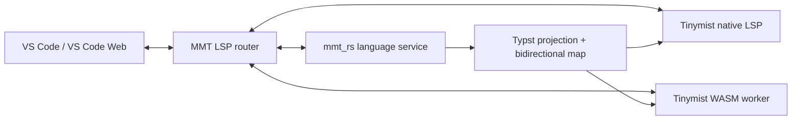

# MomoScript 复用 Tinymist 实现嵌入式 Typst LSP 的调研

> 状态：研究结论，不是已批准设计或实施承诺  
> 调研日期：2026-07-11  
> Tinymist 基线：`3d63da4f93c54ddef0c63e1a6237d67aee13f5fe`（仓库版本 `0.15.2`）

## 1. 问题与结论

MomoScript DSL v2 允许作者在以下位置直接书写 Typst：

- `@typ ... @end` 顶层注入；
- `T` / `rT` 正文；
- statement 头部 patch；
- `[:...:](...)` 资源 patch。

当前 `mmt_rs` 只用 `typst-syntax 0.15` 做语法检查、patch 参数包装检查和 overlay macro 所在 markup 区域识别。它没有 Typst completion、hover、signature help、definition、references、rename 或 semantic tokens。

**结论：Tinymist 很适合承担上述 Typst 区域的语言智能，但第一步不应直接把 `tinymist-query` 嵌入 `mmt_rs`。推荐先把 Tinymist 当作有版本边界的 Typst LSP sidecar，通过“生成的虚拟 Typst 文档 + 双向 source map”接入 MMT LSP。**

推荐形态：



这条路线复用 Tinymist 已有的 Typst 分析能力，同时避免把 Tinymist 的不稳定内部 API、patched Typst 依赖图和项目状态模型直接扩散进 MMT 编译核心。

## 2. MomoScript 当前边界

### 2.1 已具备的基础

`mmt_rs` 已经具备：

- UTF-8 byte range；
- 错误恢复 Syntax AST；
- `TypstBody`、`StatementPatch`、`ResourcePatch`、`TypDirective` 等 origin 分类；
- generated Typst chunk source map；
- generated range → MMT origin 的诊断回射；
- `analyze_text_wasm` 的纯文本 WASM ABI；
- `typst-syntax` 的正文和参数语法预检查。

相关实现：

- `mmt_rs/src/analysis.rs`
- `mmt_rs/src/typst_check.rs`
- `mmt_rs/src/emit.rs`
- `openspec/changes/redesign-dsl-syntax-v2/rust-parser-architecture.md`

### 2.2 尚缺的编辑器能力

当前 `mmt.syntax.v2` analysis surface 只返回 AST 和 parser diagnostics。它没有：

- 文档版本和 workspace document store；
- cursor-position query；
- MMT symbol index；
- LSP request/response types；
- embedded Typst virtual document；
- MMT range → generated Typst range 的反向映射；
- TextEdit 跨 source map 的安全映射规则。

因此“加入 Tinymist 依赖”本身不能完成接入。真正的边界工程是虚拟文档、请求路由和双向映射。

## 3. Tinymist 可复用的部分

### 3.1 完整语言查询引擎

Tinymist 的 `tinymist-query` 提供 completion、hover、signature help、definition、references、rename、document symbols、semantic tokens、code actions 等请求。它用：

- `SyntaxRequest` 处理仅依赖 Typst source 的查询；
- `SemanticRequest` + `LocalContext` 处理依赖项目语义的查询；
- `LspQuerySnapshot` 在不可变计算快照上执行请求。

这是最值得参考的部分：mutation 进入 project/VFS，query 在 snapshot 上执行，查询逻辑不应塞进 VS Code 命令处理器。

但上游在 `tinymist-query/src/lib.rs` 明确声明该 crate API 尚不稳定，并重度依赖不稳定组件。故“crate 已发布”不等于“适合作为稳定库 API 直接集成”。

### 3.2 Project / World / VFS

Tinymist 已拆出：

- `tinymist-project`：项目计算图、编译任务和快照；
- `tinymist-world`：Typst `World`、字体、package、路径和资源环境；
- `tinymist-vfs`：内存文件、物理文件和 revision；
- `tinymist-analysis`：类型与表达式分析；
- `tinymist-query`：编辑器查询。

`tinymist-world` 和 `tinymist-vfs` 均存在 `web` / `browser` feature，说明 upstream 已经把浏览器宿主纳入依赖边界，而不是只有 native 实现。

### 3.3 WebAssembly LSP server

Tinymist 目前具备真正的浏览器 LSP server，而不仅是 TextMate grammar：

- Rust `TinymistLanguageServer` 编译为 WASM；
- `vscode-languageclient/browser` 在扩展侧创建 client；
- Web Worker 内用 `vscode-languageserver/browser` 接收 LSP；
- Worker 把 request、notification、response 转给 WASM server。

因此，MomoScript 可以复用其 Web LSP 技术路径。Tinymist Web 扩展的功能残缺主要发生在扩展产品层：其 `extension.web.ts` 明确关闭 preview、export、package、tool、testing、drag/drop 等功能；这不等于其 WASM LSP bridge 不存在。

对 MomoScript 来说，Tinymist 只负责嵌入式 Typst language intelligence，MMT preview、pack UI 和 export 本来就应由 MMT 宿主负责，因此 Tinymist 的这些 Web UI 缺口不是直接阻塞项。

## 4. 不建议直接复用的部分

### 4.1 不直接把整个 Tinymist VS Code 扩展作为依赖

原因：

- 它注册的是 `typst` 文档语言，不认识 MMT region；
- 它不会自动把 MMT cursor 映射到 generated Typst；
- Web feature table 主动关闭了大量产品能力；
- 两个扩展直接竞争 diagnostics、commands 和 preview 状态，边界不清晰。

MomoScript 应拥有自己的扩展和 MMT LSP，由它代理嵌入式 Typst 请求。

### 4.2 第一阶段不直接依赖 `tinymist-query`

直接 crate 集成存在以下风险：

1. **API 稳定性**：上游明确不承诺 `tinymist-query` API 稳定。
2. **依赖面**：query 依赖 analysis、project、world、lint、Typst layout/library 等多个 crate，不是轻量 completion library。
3. **Typst fork 对齐**：Tinymist 的常规构建通过根 `Cargo.toml [patch.crates-io]` 使用 `Myriad-Dreamin/typst` 的 `tinymist/v0.15.0` tag，以暴露分析需要的内部信息。Cargo dependency 自己的 `[patch]` 不会自动成为 MomoScript workspace 的 patch；若要获得同等能力，MomoScript 需要主动接受并维护这组全局替换。
4. **核心污染**：`mmt_rs` 当前只依赖官方 `typst-syntax 0.15`。直接引入完整 Tinymist 查询图，会把语言编辑器依赖带进编译、CLI、NoneBot 和 WASM 核心。
5. **升级锁步**：MomoScript 的 Typst 版本、Tinymist 版本和 Tinymist patched Typst tag 必须共同升级。

`tinymist-query 0.15.2` 和 `tinymist-analysis 0.15.2` 已发布到 crates.io，说明技术上可以作为依赖；上述结论针对长期维护风险，而非“无法编译”。

### 4.3 不依赖当前 npm `tinymist-web` latest

调研时 npm registry 的 `tinymist-web/latest` 仍是 `0.12.18`，而当前仓库版本是 `0.15.2`。仓库当前构建产物名称和 API 也已经变化。因此原型应：

- 基于固定 Tinymist commit 自行构建 WASM artifact；或
- 使用对应 GitHub release 中经过验证的 Web artifact；
- 不用浮动的 npm `latest` 作为可复现构建输入。

## 5. MMT LSP 与 VS Code 扩展总体设计

Tinymist 集成只是 MMT language service 的一个内部能力。对编辑器公开的产品边界应始终是 MMT LSP；VS Code 扩展不直接拼接两套互不知情的 diagnostics 和 completion provider。

### 5.1 组件边界

建议拆成三个交付层：

```text
mmt-language-service        Rust，编辑器无关
  ├─ document/project snapshots
  ├─ MMT diagnostics and queries
  ├─ pack/resource index
  ├─ Typst projection map
  └─ TypstLanguageBackend trait

mmt-lsp                     Rust，协议与宿主适配
  ├─ standard LSP handlers
  ├─ native stdio transport
  ├─ browser worker transport
  ├─ request cancellation/version checks
  └─ Tinymist backend coordinator

editors/vscode              TypeScript，薄宿主
  ├─ extension.shared.ts
  ├─ extension.desktop.ts
  ├─ extension.web.ts
  ├─ language client
  ├─ preview/resource views
  └─ native/browser backend bootstrap
```

`mmt-language-service` 不依赖 VS Code API，不直接发送 JSON-RPC，也不执行 Typst/Tinymist 子进程。它接受版本化文档快照并返回内部 query result。`mmt-lsp` 负责 LSP 类型、position encoding、生命周期、取消和对外 capability。扩展只负责启动正确宿主、注册 UI 和转交用户动作。

这避免三个失败模式：

- 只有 VS Code 能获得完整 MMT/Typst 组合能力；
- Desktop 和 Web 分别实现一套 completion/diagnostics；
- MMT 业务规则散落在 TypeScript commands 和 webviews 中。

### 5.2 Project 与 snapshot 模型

第一版 project state 至少包含：

```rust
pub struct ProjectSnapshot {
    pub revision: Revision,
    pub documents: DocumentStore,
    pub syntax: SyntaxIndex,
    pub semantics: SemanticIndex,
    pub packs: PackIndex,
    pub projections: TypstProjectionIndex,
}
```

约束：

- 每个 `didOpen` / `didChange` / `didClose` 产生有序 revision；
- query 必须绑定 snapshot revision，旧异步结果不得覆盖新文档 diagnostics；
- 内部继续使用 UTF-8 byte offsets；LSP 边界按 client negotiation 转换 UTF-16/UTF-8 position；
- 第一版可以对单个 MMT 文档做全量 parse/lower，不应在没有性能证据前先实现增量 parser；
- pack manifest 和模板变化使依赖文档失效，但不应重算无关 workspace；
- syntax/semantic query 不得触发 materializer、网络下载或最终渲染；pack resolve 只能读取已加载的只读 manifest index。
- 编辑器 projection 必须有独立的 no-I/O 入口，不能直接调用当前会无条件进入 `materialize_resources` 的 `compile_text`。

### 5.3 MMT 标准 LSP 能力

建议按用户价值和映射风险实现：

| 阶段 | 标准 LSP capability | MMT 行为 |
|---|---|---|
| P0 | diagnostics | syntax、semantic、resolve 和映射后的 Typst diagnostics |
| P0 | document symbols | actor、asset、directive、reply/bond、`@typ` symbol |
| P0 | folding ranges | directive block、fence、reply/bond、`@typ` |
| P0 | semantic tokens | directive、speaker、actor ref、asset、resource marker、Typst region |
| P1 | completion | directive、field、mode、speaker、actor、asset、pack selector、Typst region |
| P1 | hover | DSL 文档、actor revision、resolved resource、Typst symbol |
| P1 | signature help | MMT directive/marker 参数与嵌入 Typst 调用 |
| P1 | definition | actor/asset declaration、pack entity、Typst definition |
| P2 | references | actor/asset/speaker/resource 的确定性引用 |
| P2 | rename | 仅 MMT 内具有稳定 identity 的 script actor/asset；pack canonical ID 不可 rename |
| P2 | code actions | 缺失字段、歧义 selector、废弃语法的可验证修复 |
| 后置 | formatting | 必须保留 fenced/raw Typst 和用户有意排版，不能先做破坏性 formatter |

MMT completion 与 Tinymist completion 由同一 router 决定 primary provider。MMT 区域不混入 Typst symbol，Typst identity segment 不混入 actor/resource selector；`[:...:]` overlay marker 即使位于 `T` body 中也由 MMT provider 接管。

### 5.4 `TypstLanguageBackend` 宿主接口

MMT language service 不应知道 Tinymist 是 native process、WASM worker 还是测试替身。建议形成窄接口：

```rust
pub trait TypstLanguageBackend {
    fn sync_project(&mut self, update: TypstProjectUpdate) -> BackendFuture<()>;
    fn request(&mut self, request: TypstRequest) -> BackendFuture<TypstResponse>;
    fn cancel(&mut self, request_id: RequestId);
    fn capabilities(&self) -> TypstCapabilities;
}
```

`TypstProjectUpdate` 只传递 virtual URI、版本和文件内容，不暴露任意宿主路径。`TypstCapabilities` 必须由实际 backend 报告；MMT LSP 根据 Desktop/Web 可用能力动态声明或降级，不能发送请求后静默失败。

推荐 coordinator 位于 Rust `mmt-lsp`，而不是只放在 VS Code TypeScript 扩展中。原因是 Neovim、Helix 等标准 LSP client 也应获得嵌入 Typst 能力。Web 上需要的 Worker 创建和消息端口可通过很薄的 JS host bridge 注入。

### 5.5 VS Code 扩展结构

扩展 manifest 同时声明：

```json
{
  "main": "./dist/extension.desktop.js",
  "browser": "./dist/extension.web.js"
}
```

共享层负责：

- language id、文件后缀和 activation events；
- TextMate grammar（WASM/LSP 启动前的即时基础高亮）；
- language client options；
- commands、settings schema 和状态栏合同；
- Problems、Outline、semantic tokens 等标准 LSP UI；
- preview/resource view 的共同消息类型。

Desktop 入口只负责：

- 启动随扩展固定版本分发的 `mmt-lsp`；
- 启动或定位兼容版本 Tinymist native backend；
- 连接本地 render/export 能力；
- 传入工作区 URI，不把用户文本拼进 shell command。

Web 入口只负责：

- 在 Web Worker 中启动 `mmt-lsp` WASM；
- 启动固定版本的 Tinymist WASM worker；
- 通过 `vscode.workspace.fs`/消息桥提供 workspace 文件；
- 连接 browser render backend 或明确配置的 remote render service；
- 禁止 Node `fs`、`child_process`、本机绝对路径和隐式 localhost 假设。

扩展 UI 不应读取或解释 MMT AST。资源浏览器、actor outline 和诊断详情都从版本化 language-service response 获取，避免 UI 与 compiler 对语义产生分叉。

### 5.6 Preview、资源和非标准协议

能用标准 LSP 表达的能力必须使用标准 LSP。以下产品能力可使用有版本的 `mmt/*` 扩展协议：

- `mmt/preview`：请求指定 revision 的预览；
- `mmt/previewUpdated`：返回页面/图片 URI、source revision 和 diagnostics；
- `mmt/resources`：分页列出 pack entity/set/variant，供资源浏览器使用；
- `mmt/insertResource`：返回应插入的 `[:...:]` 文本和可选 patch；
- `mmt/virtualDocument`：读取 generated Typst 或模板的只读调试内容。

每个响应必须包含 document/project revision。Webview 收到旧 revision 时直接丢弃，不能显示“代码已更新但预览仍是旧结果”的无标记状态。

资源路径必须继续遵守现有安全边界：脚本 selector 先解析为 pack identity，再由受控 materializer/host provider 读取；LSP 和 Webview 都不接受任意文件路径作为资源读取捷径。

### 5.7 Desktop/Web 对等合同

核心语言能力按 capability matrix 管理：

| 能力组 | Desktop | Web | 是否允许差异 |
|---|---:|---:|---|
| MMT syntax/semantic diagnostics | 必须 | 必须 | 否 |
| MMT completion/hover/symbols | 必须 | 必须 | 否 |
| pack manifest/resource completion | 必须 | 必须 | 否；数据源实现可不同 |
| embedded Typst diagnostics/completion/hover | 必须 | 必须 | 否 |
| native file watching | 是 | 否 | 是；Web 使用 workspace events |
| preview | 必须 | 必须 | backend 可不同 |
| PNG/PDF export | 本地 | browser/remote | backend 可不同，结果合同相同 |
| 任意本机路径/进程 | 可受控使用 | 禁止 | 是 |

CI 应对相同 fixture 回放 LSP transcript，并比较归一化后的 diagnostics、completion labels、hover、symbols 和 mapped edits。不能只验证两个 target 都能 build。

### 5.8 建议仓库布局

这是目标布局，不表示现在立即创建全部目录：

```text
mmt_rs/                         现有 compiler/language core
mmt_lsp/                        Rust LSP/coordinator crate
editors/vscode/
  package.json
  src/extension.shared.ts
  src/extension.desktop.ts
  src/extension.web.ts
  syntaxes/mmt.tmLanguage.json
  test/desktop/
  test/web/
web/                            旧 React 实现不作为新扩展基础
```

不要把新扩展继续塞进旧 `web/App.tsx`；旧 Web 编辑器可作为交互和 Typst.ts 经验来源，但不定义新语言服务架构。

### 5.9 MMT LSP 原型验收

在接 Tinymist 前，MMT LSP 最小垂直切片应证明：

1. Desktop 和 Web 打开同一 `.mmt` fixture；
2. `didChange` 后只发布当前 revision diagnostics；
3. 中文位置在 Rust byte range 与 LSP UTF-16 range 间准确往返；
4. directive/actor/resource completion 来自 Rust language service；
5. TextMate 初始高亮和 semantic tokens 接管时无明显语义冲突；
6. worker/server 崩溃可重启且不会丢失当前文档；
7. 没有 pack、网络或 render backend 时，核心编辑能力仍工作。

完成这个垂直切片后，再把下一节的 Tinymist projection backend 接入同一 router；否则同时调试 MMT LSP、VS Code Web 和 embedded Tinymist，故障边界不可辨认。

## 6. 推荐 Tinymist 集成设计

### 6.1 一个 MMT 文档对应一个虚拟 Typst projection

不要把每个 Typst fragment 独立交给 Tinymist。独立 fragment 缺少：

- `mmt-render/lib.typ` import；
- façade 函数签名；
- 文档级 `@typ` 定义；
- 前后文变量和配置；
- generated wrapper 的真实调用上下文。

应使用编辑器专用的 permissive projection pipeline 生成一个确定性的虚拟 Typst 主文件，例如：

```text
mmt-typst:/workspace/<project-id>/<document-id>/main.typ
```

虚拟 project 至少包含：

```text
main.typ
mmt-render/lib.typ
mmt-render/*.typ
受模板直接引用的小型静态资源
必要的内存占位 assets（不触发真实 materializer）
```

Tinymist 分析 `main.typ`；编辑器仍只展示 `.mmt` 文档。

这里的 projection pipeline 与当前 build pipeline 有明确差异：它可以执行 parse、mode/actor/asset
lowering 和只读 pack resolve，但必须在 materialize I/O 前停止。已解析的 avatar/sticker 使用
确定性的内存占位 Typst content 或虚拟静态资源；未解析 marker 也生成语法合法、range 稳定的
占位节点。不得用当前 `compile_text` 配一个“看似假的 materializer”后继续产生 materialize
errors，因为这会把编辑器诊断、文件/decoder I/O 和最终构建状态重新耦合起来。

### 6.2 扩展现有 source map 为双向 projection map

当前 `SourceMapEntry` 只有：

```rust
pub struct SourceMapEntry {
    pub generated_range: TextRange,
    pub origin_id: usize,
}
```

它足以做 generated diagnostic → MMT origin，但不足以安全映射 cursor 和 TextEdit。建议增加编辑器专用 projection segment：

```rust
pub struct ProjectionSegment {
    pub mmt_range: Option<TextRange>,
    pub typst_range: TextRange,
    pub kind: ProjectionKind,
    pub mapping: MappingMode,
}

pub enum MappingMode {
    Identity,
    Synthetic,
    Escaped,
    MacroExpansion,
}
```

映射规则：

- `@typ` 原文、`T/rT` raw Typst、patch 参数正文：`Identity`；
- emitter wrapper、import、函数名、括号：`Synthetic`；
- 普通 MMT text 的 Typst escaping：`Escaped`，默认不向 Tinymist 路由 cursor；
- `[:...:]` 展开：`MacroExpansion`，由 MMT language service 拥有，Tinymist 不得改写。

必须提供：

```rust
fn mmt_to_typst(offset: usize) -> Option<usize>;
fn typst_to_mmt(range: TextRange) -> Option<TextRange>;
fn map_text_edit(edit: TextEdit) -> Result<TextEdit, UnsafeProjectionEdit>;
```

任何跨越 `Synthetic`、`Escaped` 或 `MacroExpansion` 边界的 edit 都应拒绝，而不是猜测。

### 6.3 请求路由

| MMT cursor 所在区域 | 处理者 |
|---|---|
| directive、actor、asset、speaker、资源 selector | MMT language service |
| `[:...:]` selector 本体 | MMT language service |
| `@typ` 原文 | Tinymist |
| `T/rT` Typst 原文 | Tinymist |
| statement patch 参数 | Tinymist |
| resource patch 参数 | Tinymist |
| emitter 生成 wrapper | 不可直接定位 |

同一位置只应有一个 primary completion provider，避免 MMT 和 Typst 补全列表互相污染。

### 6.4 响应映射能力分级

#### 第一阶段：低风险

- Typst diagnostics；
- hover；
- signature help；
- completion（只允许完全落在单个 `Identity` segment 内的 TextEdit）；
- document symbols 中 `@typ` 内部符号的嵌套展示；
- semantic tokens（裁剪到 Typst identity ranges 后与 MMT token 合并）。

#### 第二阶段：需要目标 URI 策略

- goto definition；
- goto declaration；
- references；
- document links。

目标位于用户 MMT source 时映射回 MMT；目标位于模板库时打开 read-only virtual Typst 文档；目标只位于 synthetic wrapper 时不返回位置。

#### 后置：高风险编辑

- rename；
- formatting；
- code actions；
- workspace edits；
- willRenameFiles。

这些能力可能返回多个文件、多段 edit 或覆盖 synthetic 范围。没有严格 projection edit validator 前不得开放。

### 6.5 Diagnostics 合并

诊断来源和优先级：

1. MMT syntax；
2. MMT semantic；
3. 只读 pack resolve；
4. Tinymist 对 virtual Typst 的 syntax/type/compile diagnostics；
5. 最终 render/layout diagnostics。

合并要求：

- Tinymist diagnostic 必须先映射回 MMT；
- 只落在 synthetic wrapper 的错误，映射到最近 parent origin，并标注来源为 generated Typst；
- 由早期 MMT error 导致的级联 Typst error 应去重或抑制；
- `@typ` 和 patch 中的真实 Typst error 不得因前述抑制消失；
- Web 与 Desktop 使用同一组 golden LSP fixtures。

materialize、远端下载、AVIFS decoder 和最终 render/layout diagnostics 只在显式 preview/build
请求中产生，不进入普通 `didOpen` / `didChange` diagnostics。preview/build 返回的诊断仍应通过
同一 projection/source map 回到 MMT，但必须标注请求 revision，不能污染当前编辑快照。

## 7. Desktop 与 Web 的部署方式

### 7.1 Desktop

首选独立 Tinymist native process，由 MMT LSP 或扩展内部的 coordinator 管理：

```text
VS Code
  └─ MMT extension
      ├─ mmt-lsp native process
      └─ tinymist native process（Typst virtual documents）
```

优点：

- 不把 Tinymist 依赖链接进 `mmt_rs`；
- upstream 可独立升级和回滚；
- 崩溃隔离；
- 可以记录完整 LSP transcript 做对照测试。

代价：两个 server 的生命周期、配置和 virtual document 同步需要 coordinator。

### 7.2 VS Code Web

使用 Tinymist 已验证的基本结构：

```text
vscode-languageclient/browser
  → Web Worker
    → vscode-languageserver/browser
      → TinymistLanguageServer WASM
```

MMT Web Extension 可选择：

- 一个 coordinator worker 内同时运行 MMT core 和 Tinymist；或
- MMT worker 与 Tinymist worker 分离，通过扩展 host 路由。

推荐先分离 worker。Tinymist WASM 的初始化、内存峰值或 panic 不应阻塞 MMT parser diagnostics。原型测得资源占用后再决定是否合并。

### 7.3 Web 文件系统

需要专门验证以下问题：

- `didOpen` 的虚拟 `main.typ` 能否 import 同样通过内存事件注册的模板文件；
- `vscode.workspace.fs` 的非 `file:` URI 如何映射进 Tinymist path model；
- package registry 在 browser feature 下的实际行为；
- font loading 是否会阻塞纯语言查询；
- virtual assets 缺失是否产生不可控的 compile diagnostic；
- 大型 WASM 的加载时间、内存和 worker 重启时间。

这些是原型的验收项，当前调研不能仅从 feature flag 推断全部已经可用。

## 8. Tinymist 复用方案比较

| 方案 | 复用程度 | Web 对等 | 耦合 | 建议 |
|---|---:|---:|---:|---|
| 只用 `typst-syntax` 自研所有 Typst LSP | 低 | 可控 | 低 | 不建议，重复实现 Tinymist |
| 直接链接 `tinymist-query` | 高 | 理论可行 | 很高 | 暂不采用 |
| 链接整个 `tinymist` crate | 很高 | 可行 | 高 | 不作为第一步 |
| native/WASM Tinymist LSP sidecar + virtual projection | 高 | 高 | 中 | **推荐原型** |
| fork Tinymist | 最高 | 可自行补齐 | 极高 | 不建议 |
| 与 upstream 合作抽稳定 embedded/query API | 高 | 高 | 中低 | **长期优选** |

## 9. 推荐联合原型范围

原型只回答可行性，不建设完整 VS Code 产品。

### 输入 fixture

至少覆盖：

1. `@typ` 内函数定义与调用；
2. `T` body 中函数 completion；
3. statement patch 中参数 completion/signature；
4. resource patch 中非法 Typst 诊断；
5. `[:...:]` 与 Typst syntax 混合，确保请求路由不越界；
6. 中文文本，验证 UTF-8 byte offset ↔ LSP UTF-16 position；
7. 模板 façade symbol 的 hover/definition；
8. MMT 语法暂时不完整时，Typst 查询仍能恢复。

### 验收

- Desktop 与 Web 对相同 fixture 返回同类 completion/hover/diagnostic；
- diagnostic range 精确回到 MMT；
- completion TextEdit 不覆盖 `[:...:]` 或 generated wrapper；
- Web 不访问 Node API；
- worker 失败后 MMT 自身诊断仍可用；
- Tinymist artifact 和 commit 可复现；
- 记录 WASM 文件大小、冷启动、首个 completion latency 和峰值内存，不预设阈值。

### 原型后决策门

只有以下问题得到实测答案后，才决定生产依赖形态：

- sidecar 是否能稳定读取完整 virtual project；
- Web LSP 实际支持的查询集合；
- bundle/memory 是否可接受；
- source map 是否足以承载 completion edits；
- upstream 是否愿意稳定 virtual document / query host API；
- patched Typst 版本是否会阻塞 MMT 的 Typst 升级。

## 10. 许可证与供应链

- MomoScript 当前使用 MPL-2.0；
- Tinymist 使用 Apache-2.0；
- Tinymist crate 和 Web artifact 应保留 Apache-2.0 license、版权和必要 notice；
- 若复制或修改上游源码，应保持文件来源和变更记录；
- 发布 VSIX/Web bundle 前应生成 Rust/JS 依赖许可证清单；
- 生产构建固定 Tinymist 版本/commit 和 WASM checksum；
- 本节是工程合规建议，不是法律意见。

## 11. 建议决策

建议团队暂定：

1. **先建设编辑器无关的 `mmt-language-service` 和最小 `mmt-lsp` 垂直切片。**
2. **MMT LSP 是唯一前台 language server；VS Code 扩展保持薄宿主，Tinymist 是被代理的内部服务。**
3. **推荐 Rust `mmt-lsp` 承担 coordinator，TypeScript 只注入 native/Web host backend。**
4. **Desktop 与 Web 共享 query、协议和 fixture，只允许文件系统、渲染、导出等宿主实现不同。**
5. **采用 Tinymist 作为嵌入式 Typst language intelligence 的首选上游。**
6. **以 generated Typst virtual project 和双向 projection map 连接 MMT 与 Tinymist。**
7. **先用 native/WASM LSP sidecar 验证，不直接耦合 `tinymist-query`。**
8. **preview/export/pack UI 由 MomoScript 自己实现，不继承 Tinymist Web 扩展的功能缺口。**
9. **原型后优先与 Tinymist upstream 讨论稳定的 embedded/query API，而不是长期维护 fork。**

## 12. 待与 Codex / 团队讨论的问题

1. 是否接受 Rust `mmt-lsp` coordinator 作为默认方案，而不是在 VS Code TypeScript 层拼接两个公开 LSP client？
2. 第一版建议先作为现有 `mmt_rs` 的内部 `language_service` 模块复用私有 AST/IR；等 snapshot/query 边界稳定后，是否再拆成独立 crate？
3. 第一版 VS Code 扩展是否同时交付 Desktop/Web，还是先做不含 preview 的双端 language vertical slice？
4. `mmt/preview`、`mmt/resources`、`mmt/virtualDocument` 的自定义协议是否符合产品边界？
5. 虚拟 Typst 文档使用完整 permissive emission，还是 region-preserving whitespace projection？
6. 是否接受先把 `ProjectionSegment` 作为 Rust 内部版本化结构，只稳定 LSP 行为和测试 fixture，而不在原型期承诺跨语言稳定 ABI？
7. 模板库 definition 应打开 read-only virtual source，还是跳到仓库真实 `.typ` 文件？
8. Desktop 是否自动下载固定 Tinymist binary，还是随 VSIX 打包？
9. Web artifact 是自行从固定 commit 构建，还是等待 upstream 恢复稳定 npm 发布？
10. 第一版是否只开放 diagnostics/completion/hover/signature/semantic tokens，并明确禁用 embedded rename/formatting？
11. 是否向 Tinymist upstream 提议稳定的 virtual `World`/query host API？

## 13. 主要资料

所有 Tinymist 源码链接均固定到本次调研 commit，避免 `main` 漂移。

- [Tinymist 基线提交](https://github.com/Myriad-Dreamin/tinymist/commit/3d63da4f93c54ddef0c63e1a6237d67aee13f5fe)
- [Tinymist workspace 与 patched Typst 依赖](https://github.com/Myriad-Dreamin/tinymist/blob/3d63da4f93c54ddef0c63e1a6237d67aee13f5fe/Cargo.toml)
- [`tinymist-query` 公共接口与不稳定声明](https://github.com/Myriad-Dreamin/tinymist/blob/3d63da4f93c54ddef0c63e1a6237d67aee13f5fe/crates/tinymist-query/src/lib.rs)
- [`LspQuerySnapshot` 与 semantic query](https://github.com/Myriad-Dreamin/tinymist/blob/3d63da4f93c54ddef0c63e1a6237d67aee13f5fe/crates/tinymist-query/src/analysis.rs)
- [`tinymist-query` 依赖与 features](https://github.com/Myriad-Dreamin/tinymist/blob/3d63da4f93c54ddef0c63e1a6237d67aee13f5fe/crates/tinymist-query/Cargo.toml)
- [`tinymist-world` Web/browser features](https://github.com/Myriad-Dreamin/tinymist/blob/3d63da4f93c54ddef0c63e1a6237d67aee13f5fe/crates/tinymist-world/Cargo.toml)
- [`tinymist-vfs` Web/browser features](https://github.com/Myriad-Dreamin/tinymist/blob/3d63da4f93c54ddef0c63e1a6237d67aee13f5fe/crates/tinymist-vfs/Cargo.toml)
- [Tinymist WASM LSP server](https://github.com/Myriad-Dreamin/tinymist/blob/3d63da4f93c54ddef0c63e1a6237d67aee13f5fe/crates/tinymist/src/web.rs)
- [VS Code Web language client](https://github.com/Myriad-Dreamin/tinymist/blob/3d63da4f93c54ddef0c63e1a6237d67aee13f5fe/editors/vscode/src/lsp.web.ts)
- [Tinymist Web Worker LSP bridge](https://github.com/Myriad-Dreamin/tinymist/blob/3d63da4f93c54ddef0c63e1a6237d67aee13f5fe/editors/vscode/src/web/server.ts)
- [Tinymist Web 扩展 feature table](https://github.com/Myriad-Dreamin/tinymist/blob/3d63da4f93c54ddef0c63e1a6237d67aee13f5fe/editors/vscode/src/extension.web.ts)
- [Tinymist Web WASM 构建配置](https://github.com/Myriad-Dreamin/tinymist/blob/3d63da4f93c54ddef0c63e1a6237d67aee13f5fe/crates/tinymist/package.json)
- [Tinymist VS Code Web 支持 issue #970](https://github.com/Myriad-Dreamin/tinymist/issues/970)
- [Tinymist Web bundle PR #1945](https://github.com/Myriad-Dreamin/tinymist/pull/1945)
- [过期 npm 发布问题 #2431](https://github.com/Myriad-Dreamin/tinymist/issues/2431)
- [VS Code 官方 Embedded Languages 指南](https://code.visualstudio.com/api/language-extensions/embedded-languages)
- [VS Code 官方 Web Extensions 指南](https://code.visualstudio.com/api/extension-guides/web-extensions)
- [VS Code 官方 Language Server Extension 指南](https://code.visualstudio.com/api/language-extensions/language-server-extension-guide)
- [LSP 3.17 规范](https://microsoft.github.io/language-server-protocol/specifications/lsp/3.17/specification/)
- [`tinymist-query` crates.io 页面](https://crates.io/crates/tinymist-query)
- [`tinymist-analysis` crates.io 页面](https://crates.io/crates/tinymist-analysis)
- [`tinymist-web` npm registry](https://www.npmjs.com/package/tinymist-web)
